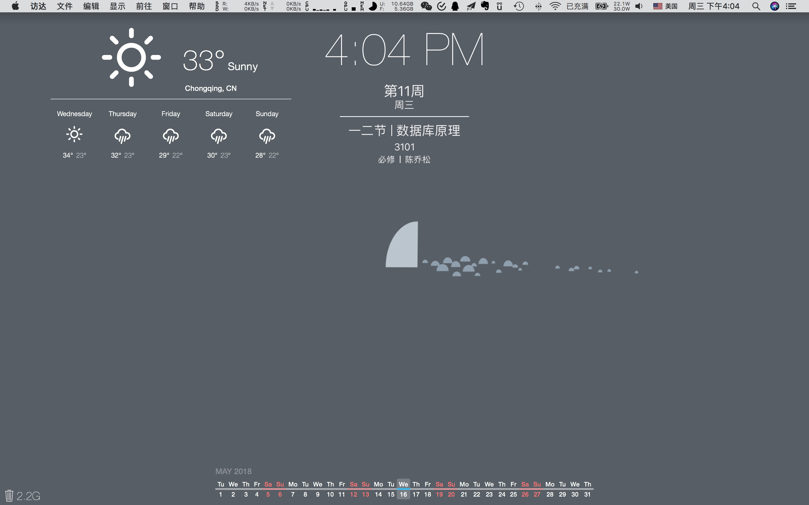
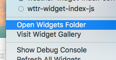
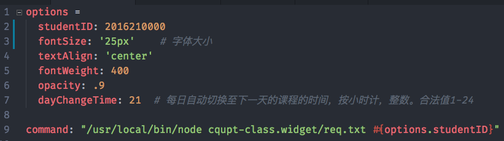

# 重邮课表 - Übersicht/Uebersicht插件

此插件是使用 `CoffeeScript`, `NodeJS`, `stylus` 等技术，个人开发的重邮课表Übersicht插件。

效果图：


## Übersicht是什么？
首先上官网：http://tracesof.net/uebersicht/

简而言之，Übersicht就是一款mac定制桌面的插件。我来上张自己定制的桌面图：

诸如天气，时间日期，以及垃圾桶大小等，都可以便捷地放在桌面上。同时还有很多小组件，大家可以在Übersicht的官网上下载。[这里](https://github.com/felixhageloh/uebersicht-widgets)是Übersicht创始人Felix收集的插件库。


## 如何使用？

安装之前请确保你已经安装了node。

使用方式和一般的Übersicht插件没两样。[触动力](https://www.hitnology.com/video-980.html)做过一个关于Übersicht的视频。大家可以参考使用。

我这里也写了下安装以及配置本插件的教程：

第一，在状态栏找到Übersicht图标，然后打开插件所在文件夹：

第二，在这个文件夹处打开终端，运行以下命令：

```
$ git clone https://github.com/CoderMing/cqupt-class.widget
```

然后就可以看到安装好的效果了。


## 如何配置？

本插件的结构：

```
├── README.md   
├── index.coffee     //插件入口文件
├── pic              //readme图片显示
└── req.txt          // 请求文件，内容为JavaScript
```

你可以打开安装文件夹，并打开本插件文件夹内的 `index.coffee` 文件。我已经抽离了一些配置参数放在了文件开头的`options`对象里了。

首先请将学号替换成你的学号，



如果你想深度定制（比如修改位置等），需要修改代码。本插件样式使用`stylus`的语法，js使用`CoffeeScript`。

提示：修改位置只需要修改 id 为 `cquptClass` 的属性即可。

### node路径不对？

经过测试，插件的`shell command`好像不能直接访问node环境变量。所以我找到了node的绝对路径。

如果你发现不能正常调用node路径的话，请在命令行输入如下命令：

```
$ echo `which node` | pbcopy
```

这样node的路径就粘贴到你的剪切板了。然后将`index.coffee`的command命令的第一个参数替换掉即可。


## 交流

请在在本仓库发issue。

[@CoderMing](https://github.com/coderming)